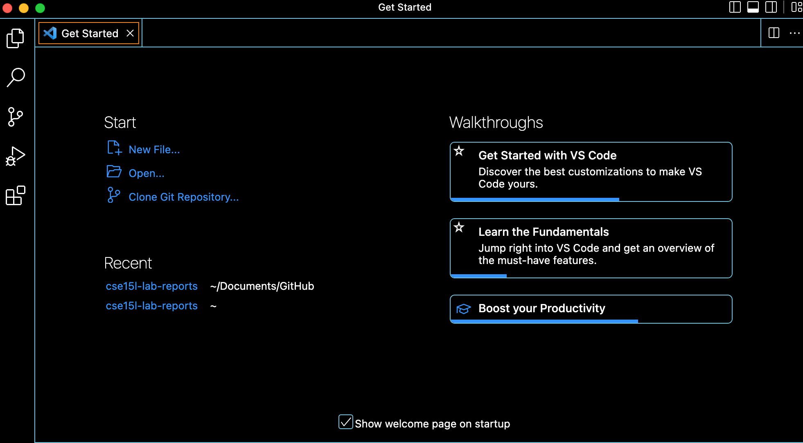
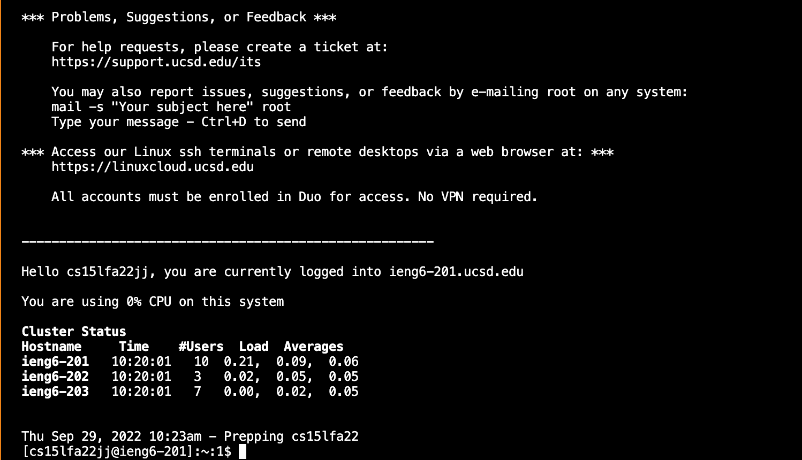
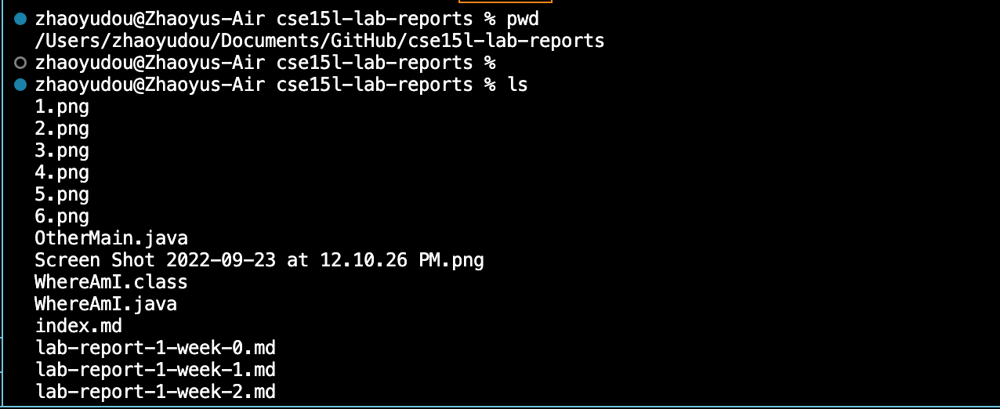
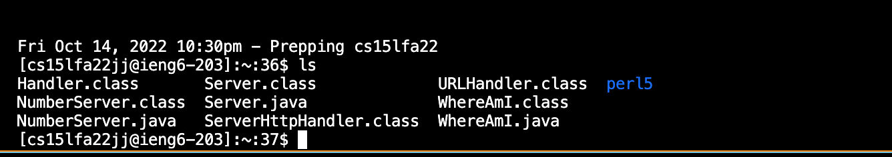
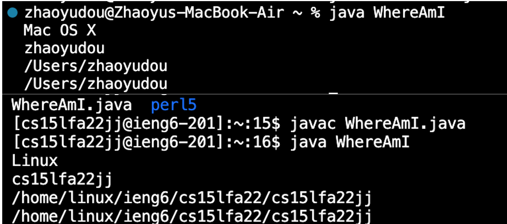
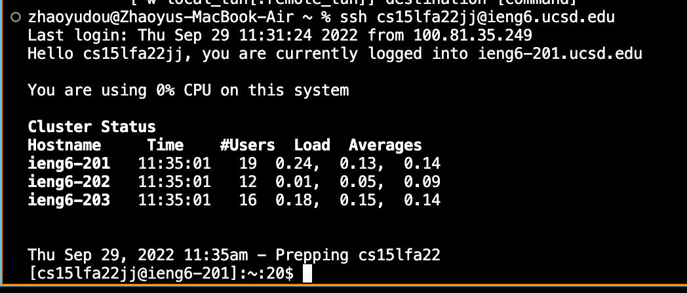
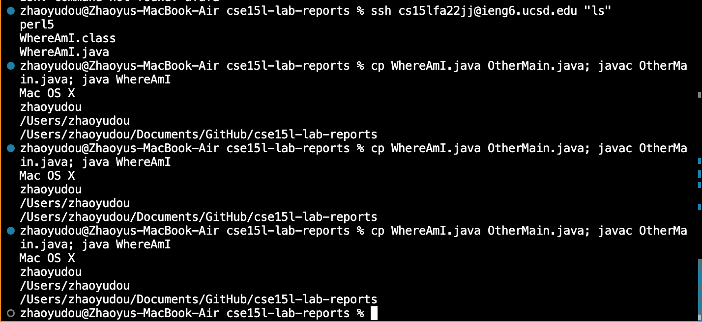

Part 1

Install Visual Studio Code: We need to go to the official website of Visual Studio Code https://code.visualstudio.com/ to download the app. There are 3 options for different operating systems, select one that fits your laptop.

Part 2

Remotely Connecting:You can go to https://sdacs.ucsd.edu/~icc/index.php to find your student account and follow the instructions on the website to reset your password. Then we need to type $ssh cs15lfa22jj@ieng6.ucsd.edu(use your own account) to connect the remote server. If you are first time connecting to the server, there might be some messages. Just say yes to these messages and give your password to connect the server.

Part 3

 Trying Some Commands: Try running different commands both on your computer and on the remote sever. For example: ls, pwd, and cat. For example, I printed out the working directory by typing “pwd”. I also typed "ls" to show files in current directory.

Part 4

 Moving Files with scp:  In order to move files from local computer and remote server, we can use command scp transfer files back and forth.(scp WhereAmI.java cs15lfa22zz@ieng6.ucsd.edu:~/) As you can see, I created a file called WhereAmI.java on my laptop, then I copy and paste it with the command “scp ”in the remote server and ran the file. (Type javac WhereAmI.java and java WhereAmI to run the java file:
class WhereAmI {
  public static void main(String[] args) {
    System.out.println(System.getProperty("os.name"));
    System.out.println(System.getProperty("user.name"));
    System.out.println(System.getProperty("user.home"));
    System.out.println(System.getProperty("user.dir"));
  }
}) If you move the file successfully, you will get different information about the name of operating system, user, and directory.

Part 5

 Setting an SSH Key: The reason we set an SSH Key is every time we log in and run scp, we have to type password. By setting an SSH key, we will save a lot of time. Type $ ssh-keygen to generate public/rsa key pair. When you see "Enter file in which to save the key (/Users/joe/.ssh/id_rsa)" press enter again. If you use Windows, follow the extra ssh-add steps here: https://docs.microsoft.com/en-us/windows-server/administration/openssh/openssh_keymanagement#user-key-generation. Then copy the public key to the .ssh directory of your user account.After that, you don’t need to type password to login remote server.

part 6

 Optimizing Remote Running: You can write command in quotes after ssh command to run it on remote server. For example:  ssh cs15lfa22@ieng6.ucsd.edu "ls" This command will list the home directory on remote server. One more way to optimize is to use semicolons to run multiple commands on one line. For example:  cp WhereAmI.java OtherMain.java; javac OtherMain.java; java WhereAmI. These tricks are gonna save your time and reduce some lines of code.

