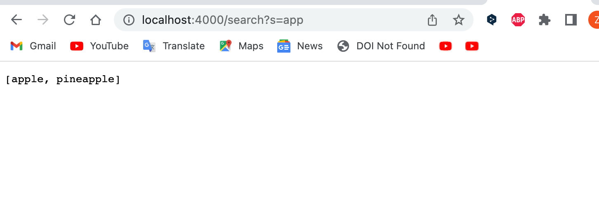

# Lab Report 2
## Part 1
### Search Engine
```
import java.io.IOException;
import java.net.URI;
import java.util.ArrayList;

class Handler implements URLHandler {
    // The one bit of state on the server: a number that will be manipulated by
    // various requests.
    int num = 0;
    ArrayList<String> arr = new ArrayList<String>();
    ArrayList<String> new_arr = new ArrayList<String>();

    public String handleRequest(URI url) {
        if (url.getPath().equals("/")) {
            return String.format("Number: %d", num);
        } else if (url.getPath().equals("/increment")) {
            num += 1;
            return String.format("Number incremented!");
        } else {
            System.out.println("Path: " + url.getPath());
            if (url.getPath().contains("/add")) {
                String[] parameters = url.getQuery().split("=");
                if (parameters[0].equals("s")) {
                    arr.add(parameters[1]);
                    return "I just added " + parameters[1];
                }
            }
            if (url.getPath().contains("/search")) {
                String[] parameters = url.getQuery().split("=");
                if (parameters[0].equals("s")) {
		            for(int i = 0; i<arr.size();i++) {
				    if(arr.get(i).contains(parameters[1]))
                    {
				        new_arr.add(arr.get(i));
                    }
                }
                    return String.format("" + new_arr);
                }
            }
            return "404 Not Found!";
        }
    }
}

class SearchEngine {
    public static void main(String[] args) throws IOException {
        if(args.length == 0){
            System.out.println("Missing port number! Try any number between 1024 to 49151");
            return;
        }

        int port = Integer.parseInt(args[0]);

        Server.start(port, new Handler());
    }
}
```

### Add apple


Which methods in your code are called?

The method that has been called is public String handleRequest(URI url)

What the values of the relevant arguments to those methods are, and the values of any relevant fields of the class? 

The relevant arguments to the method is url, and the value of url is "/add?s=apple". The relevant fields of the class are parameters and arr, in this case, the parameters are "s" at index 0 and "apple" at index 1, and arr is the list that stores inputs which has a string of "apple" at index 0. 

If those values change, how they change by the time the request is done processing?

The values of those relevant fields are not gonna change by the time the request is done processing, as the arr stores inputs. However, if a new request has been created, the value might change.

### Add Pineapple


Which methods in your code are called?

The method that has benn called is public String handleRequest(URI url)

What the values of the relevant arguments to those methods are, and the values of any relevant fields of the class? 

The relevant arguments to the method is url, and the value of url is "/add?s=pineapple". The relevant fields of the class are parameters and arr, in this case, the parameters are "s" at index 0 and "pineapple" at index 1, and arr is the list that stores inputs which has a string of "apple" at index 0 and a string of "pineapple" at index 1. 

If those values change, how they change by the time the request is done processing?

The values of those relevant fields are not gonna change by the time the request is done processing, as the arr stores inputs. However, if a new request has been created, the value might change.

### Search app


Which methods in your code are called?

The method that has benn called is public String handleRequest(URI url)

What the values of the relevant arguments to those methods are, and the values of any relevant fields of the class? 

The relevant arguments to the method is url, and the value of url is "/search?s=app". The relevant fields of the class are parameters, arr and new_arr, in this case, the parameters are "s" at index 0 and "app" at index 1, and arr is the list that stores inputs which has a string of "apple" at index 0 and a string of "pineapple" at index 1, and new_arr stores outputs which contains both "apple" and "pineapple" to be returned. 

If those values change, how they change by the time the request is done processing?

The values of those relevant fields are not gonna change by the time the request is done processing, as the arr stores inputs and new_arr stores outputs. However, if a new request has been created, the value might change. 

## Part 2
### Bug 1 from ArrayExamples.java
The failure-inducing input (the code of the test):
```
	@Test 
	public void testReverseInPlace() {
        int[] input1 = { 1,2,3,4,5 };
        ArrayExamples.reverseInPlace(input1);
        assertArrayEquals(new int[]{ 5,4,3,2,1 }, input1);
	}
```

The symptom (the failing test output):

The expected output was 5,4,3,2,1 but the actual was 5,4,3,4,5.

The bug (the code fix needed):

The buggy code:
```
    static void reverseInPlace(int[] arr) {
        for(int i = 0; i < arr.length; i += 1) {
        arr[i] = arr[arr.length - i - 1];
        }
    }
``` 
The fixed code:
```
    static void reverseInPlace(int[] arr) {
        for(int i = 0; i < arr.length/2; i += 1) {
        int temp = arr[i];
        arr[i] = arr[arr.length - i - 1];
        arr[arr.length - i - 1] = temp;
        }
    }
```

The symptom occurs because this method only reverses the values from the right side of an arraylist and simply replace them on the left side, but does not swap the values that originially on the left side to the right side. Therefore, the input of {1,2,3,4,5} returns an output of {5,4,3,4,5} instead of {5,4,3,2,1}.

### Bug 2 from ListExamples.java
The failure-inducing input (the code of the test):
```
public class ListTests{
    @Test
    public void test1(){
        List<String>list = new ArrayList<>();
        list.add("first");
        list.add("second");
        list.add("third");
        List<String>result= new ArrayList<>();
        result.add("first");
        result.add("third");
        Chooser theChooser =new Chooser();
        list = ListExamples.filter(list,theChooser);
        assertEquals(result,list);
    }
}
```
The symptom (the failing test output):

The expected output was  [first, third] but the actual was [third, first].

The bug (the code fix needed):

The buggy code:
```
static List<String> filter(List<String> list, StringChecker sc) {
    List<String> result = new ArrayList<>();
    for(String s: list) {
      if(sc.checkString(s)) {
        result.add(0, s);
      }
    }
    return result;
  }
```
The fixed code:
```
  static List<String> filter(List<String> list, StringChecker sc) {
    List<String> result = new ArrayList<>();
    for(String s: list) {
      if(sc.checkString(s)) {
        result.add(s);
      }
    }
    return result;
  }
```
I also implemented the interface StringChecker to select the string that has length less than 6 characters.
```
interface StringChecker { boolean checkString(String s); }

class Chooser implements StringChecker {
  public boolean checkString(String s){
    return s.length() < 6;
  }
} 
```
The symptom occurs because "result.add(0, s);" the result adds every element at the index 0, which would reverse the output list order. This line of code was supposed to add the new elements at the last of the array list. Therefore, we should write  "result.add(s);" to fix this bug.