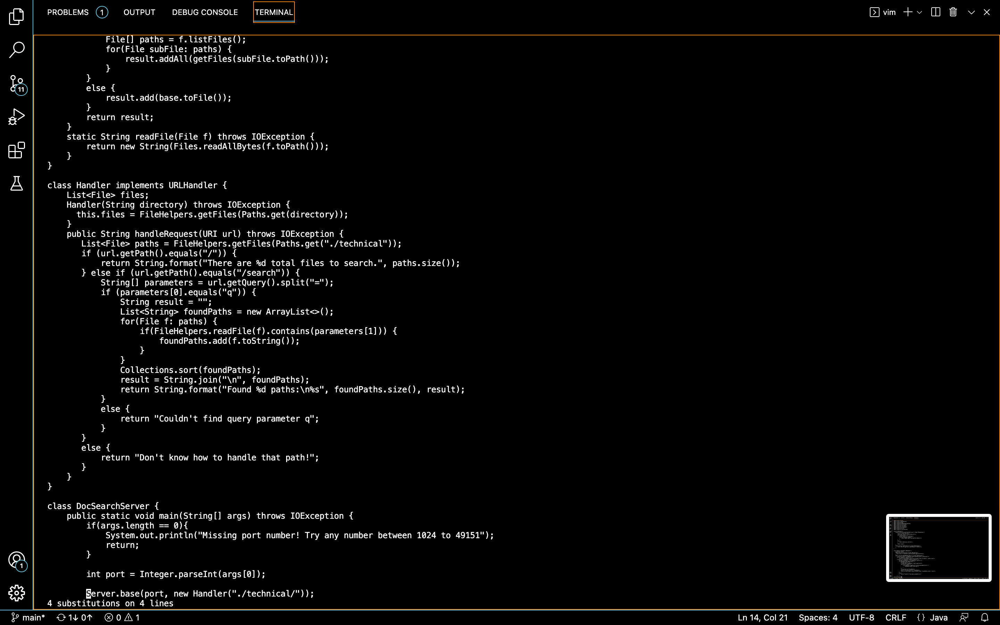

## Part 1

Changing the name of the start parameter and its uses to base:

```
:%s/start/base/g<Enter>:w<Enter>

```
This is the original file.


That's my first key pressed ```:```


After typing ```%s/start/base/g```


After pressing```<Enter>```


Then I typed ```:w``` to save the changes


Finally, I pressed ```<Enter>``` to save the file.


## Part 2

For the first one, I spent 76 seconds fixing the test and confirming it works. The difficulty I encountered with was typing the wrong character which caused me failed at the first time.
The second one only took me 45 seconds and I did it well.

Which of these two styles would you prefer using if you had to work on a program that you were running remotely, and why?

I would prefer using the second style as it costs me less time. When we use the first style for small programs, we often need more typing to solve the same problem.

What about the project or task might factor into your decision one way or another? (If nothing would affect your decision, say so and why!)

I would use the first style when I am working on a project or task which typically requires a lot of typing and editing. Working on Visual Studio Code helps me find syntax errors and helps me run the code and debug it. Vim is just a text editor and can't run the code, which means I can't get feedback until I complete writing the file.
