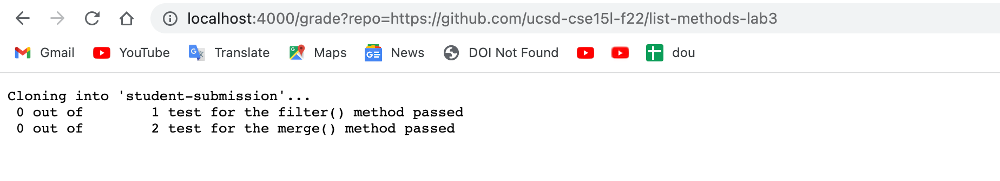
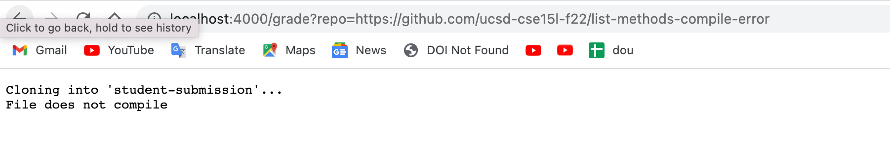
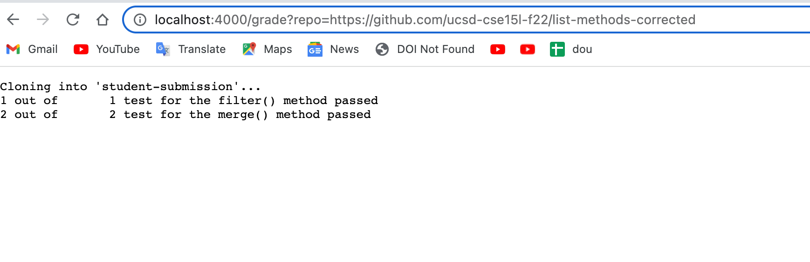

## Part 1
```
CPATH=.:lib/hamcrest-core-1.3.jar:lib/junit-4.13.2.jar
rm -rf student-submission
git clone $1 student-submission

cp TestListExamples.java student-submission/
cp -R lib student-submission
cd student-submission
if [[ -e TestListExamples.java ]]
then
    javac -cp $CPATH *.java 2> stderror.txt
else
    echo "File does not exist"
    exit 1
fi
[ -s stderror.txt ]
if ! [ $? -eq 0 ]
then
    java -cp $CPATH org.junit.runner.JUnitCore TestListExamples 1> stdoutput.txt
else
    echo "File does not compile"
    exit 1
fi

filtertest=$(grep -o -i "filtertest" TestListExamples.java | wc -l)

mergetest=$(grep -o -i "mergetest" TestListExamples.java | wc -l)

filterfailed=$(grep -o -i " filtertest" stdoutput.txt | wc -l)

mergefailed=$(grep -o -i " mergetest" stdoutput.txt | wc -l)

filterpassed=$(echo "$filtertest-$filterfailed" | bc)

mergepassed=$(echo "$mergetest-$mergefailed" | bc)

echo " $filterpassed out of $filtertest test for the filter() method passed"

echo " $mergepassed out of $mergetest test for the merge() method passed"
```
## Part 2




## Part 3

I choose the second one as an example to describe what grade.sh does on that.

```
CPATH=.:lib/hamcrest-core-1.3.jar:lib/junit-4.13.2.jar
``` 
The CPATH stores ```.:lib/hamcrest-core-1.3.jar:lib/junit-4.13.2.jar```

```
rm -rf student-submission
```
The rm -rf command removes the old student-submission directory.

```
git clone $1 student-submission
```
git clone takes url as an parametr to clone the student submissions and store it in student-submission directory

```
cp TestListExamples.java student-submission/
```
cp copies java file TestListExample to the student-submission directory
```
cp -R lib student-submission
```
cp -R copies lib directory to the student-submission directory

```
cd student-submission
```
cd changes the current directory to the student-submission

```
if [[ -e TestListExamples.java ]]
````
-e checks if the file exists
The condition of this if statement is true here as the file exists.
```
javac -cp $CPATH *.java 2> stderror.txt
```
Then, javac would compile the file and redirect the error message to the stderror.txt.

```
else
    echo "File does not exist"
    exit 1
```
The else section does not run as the file exists so the if condition is true.

```
fi
```
fi exit the if statement.

```
[ -s stderror.txt ]
```
This line of code is used to check the size of stderror.txt.
```
if ! [ $? -eq 0 ]
```
The ```$?``` would be zero if stderror.txt is not empty and would be some other number otherwise. In this case, it equals to 0.
```
then
    java -cp $CPATH org.junit.runner.JUnitCore TestListExamples 1> stdoutput.txt
```
This block of codes is skipped as the if condition is false.
```
else
    echo "File does not compile"
    exit 1
```
It prints the message "File does not compile" as the file has error and exit.
```
fi
```
fi exit the if statement

The rest of the grdes.sh code does not run as the exit code 1 stops the program there.
